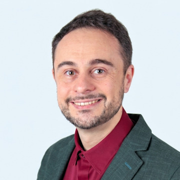

::: {.hero-banner}
{width="40%"}

# Welcome to Evolutionary Computation in Practice (ECiP)

**Bridging Academia and Industry in Evolutionary Computation**
:::

---

The Evolutionary Computation in Practice (ECiP) track at GECCO brings together world-renowned experts from academia and industry to share their insights on real-world optimization and successful collaborations. ECiP is the place to learn how evolutionary computation is applied beyond textbooks, with a focus on practical, impactful projects and industrial partnerships.

---

## 🕔 ECiP at GECCO 2026

ECiP 2026 will take place at [**GECCO 2026**](https://gecco-2026.sigevo.org/) in San Antonio de Belén, Alajuela, Costa Rica (July 13–17, 2026).

- **When:** Thursday, July 16, 2026, 17:00–18:00 (5:00–6:00 pm)
- **Format:** A single one-hour session — the closing session of the day
- **Program:** Four presentations (15 minutes each, including discussion)
- **Organizers:**
    - Thomas Bartz-Beielstein, IDE+A, TH Köln, Germany
    - Daniel Hernández, Tecnológico Nacional de México/IT Tijuana, Mexico
    - Francisco Fernandez de Vega, Universidad de Extremadura, Spain

### Confirmed Speakers

::: {.speaker-grid}

::: {.speaker-card}

Nicolás Álvarez Gil
Senior Researcher, Mathematical Optimization — ArcelorMittal Global R&D, Spain

Applying Evolutionary Computation to Real-World Steel Problems: Challenges Beyond Theory

:::

::: {.speaker-card}

Ryoki Hamano
Research Scientist — CyberAgent AI Lab, Japan

Evolutionary Computation in an Industrial AI Lab: Applications, Research, and Open Tools

:::

::: {.speaker-card}

Alberto Tonda
Senior Researcher (Directeur de Recherche) — INRAE, Université Paris-Saclay, France

Title to be announced

:::

:::

<strong>Talk details — Nicolás Álvarez Gil</strong>

<strong>Abstract.</strong> This talk presents practical experiences in applying evolutionary computation (EC) to real-world optimization problems within the steel industry at ArcelorMittal. It focuses on challenges such as handling complex and dynamic constraints, balancing multiple conflicting objectives, and delivering robust solutions under tight industrial timelines. The presentation will cover the full lifecycle of optimization projects, from problem understanding and model design to algorithm development, validation with real data, and integration into user-friendly decision-support tools. Special attention will be given to the need for tailored EC approaches to bridge the gap between academic methods and industrial requirements, as well as to the long-term maintenance and adaptability of deployed solutions.

<strong>About the speaker.</strong> Nicolás Álvarez is a Senior Researcher in the Mathematical Optimization team at ArcelorMittal Global R&D in Asturias, Spain. His work focuses on applying operations research and advanced optimization techniques to industrial problems, including production planning and scheduling, logistics, inventory management, supply chain optimization, and network design. He has extensive experience in developing decision-support tools that integrate advanced algorithms into real industrial environments, with a strong focus on bridging the gap between academic research and practical applications. He is also involved in the organization of the IAM workshop at GECCO (Industrial Applications of Metaheuristics). In addition to his work in industry, he has served as an Adjunct Professor at the University of Oviedo, teaching courses related to optimization and operations research.

<strong>Talk details — Ryoki Hamano</strong>

<strong>Abstract.</strong> This talk presents how evolutionary computation is practiced at CyberAgent AI Lab through three complementary activities: applications, research, and open tools. On the application side, it introduces a real-world combinatorial optimization problem in game-balance tuning, where a genetic algorithm with an embedding-based mutation operator searches for high-scoring team configurations before new content is added. On the research and tooling side, it discusses work on CMA-ES, including the open-source cmaes Python library and recent methods for mixed-variable black-box optimization. The talk shares lessons on making evolutionary computation useful in industry while contributing reusable methods and tools to the wider community.

<strong>About the speaker.</strong> Ryoki Hamano is a Research Scientist at CyberAgent AI Lab, Japan. He received his Ph.D. in Informatics from Yokohama National University in 2024. His research focuses on black-box optimization, especially CMA-ES and mixed-variable optimization involving continuous, integer, and categorical variables. His papers on mixed-variable black-box optimization received Best Paper Nominations in the ENUM track at GECCO 2022 and GECCO 2025. Some of these methods have been implemented in open-source optimization tools, including the cmaes Python library and Optuna.

Further speakers and talk titles will be announced here soon.

---

::: {.feature-grid}

::: {.feature-card}
### 🧠 Learn from the best
Hear from speakers with decades of experience in both academic and industrial settings.
:::

::: {.feature-card}
### 🌍 Real-world impact
Discover how evolutionary computation solves real optimization problems for clients and industry partners.
:::

::: {.feature-card}
### 📈 Project management
Gain valuable tips for managing and executing successful projects.
:::

::: {.feature-card}
### 🤝 Networking
Connect with experts and peers in a hybrid event format.
:::

:::

## About GECCO

GECCO is sponsored by the Association for Computing Machinery Special Interest Group on Genetic and Evolutionary Computation (SIGEVO).

  
  
  

---

## Explore More

- [**Reference:** ECiP Speakers & Talks](reference.qmd)
- [**GECCO 2026** (official conference website)](https://gecco-2026.sigevo.org/)
- [GECCO 2025](https://gecco-2025.sigevo.org/)
- [GECCO 2024](https://gecco-2024.sigevo.org/)
- [GECCO 2023](https://gecco-2023.sigevo.org/)
- [GECCO 2022](https://gecco-2022.sigevo.org/)

