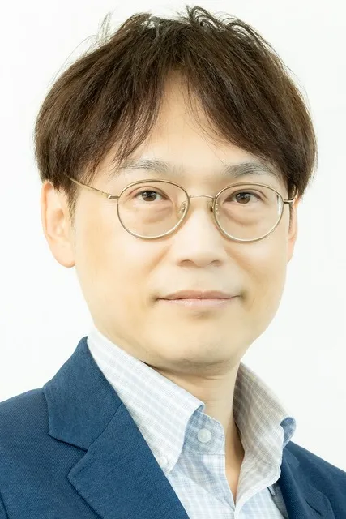
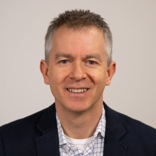
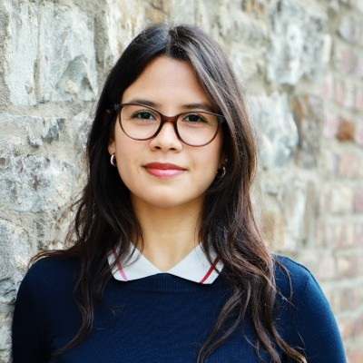
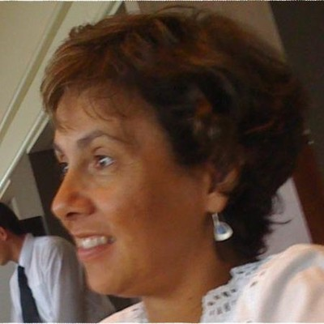
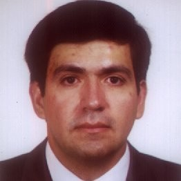
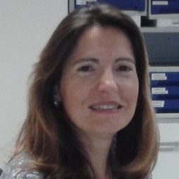
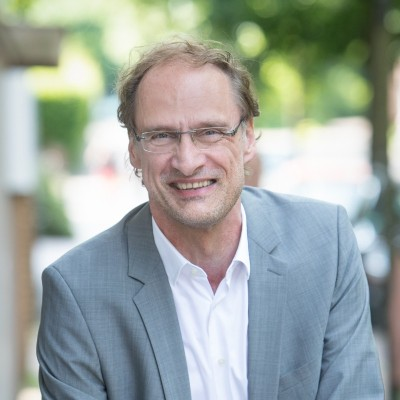
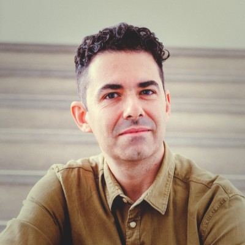
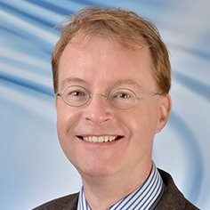
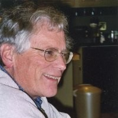

# Evolutionary Computation in Practice (ECiP)

The *Evolutionary Computation in Practice (ECiP)* track at GECCO has functioned for over fifteen years as a specialized forum for bridging the gap between theoretical innovation and industrial application. While broader academic tracks prioritize peer-reviewed proofs, ECiP focuses on the operational complexities of real-world optimization. It brings together experts who manage corporations, lead large-scale industrial projects, and navigate the intricate landscape of academia-industry partnerships to share high-level insights that extend beyond textbook methodologies.


## 2025: Foundations and Applications

The 2025 program highlights the relationship between academic foundations and industrial relevance, exploring why certain simpler strategies often outperform complex methods in practice.

Organizers: Thomas Bartz-Beielstein, Richard Schulz.


::: {.speaker-grid}

::: {.speaker-card}

<span class="speaker-name">Dr. Roman Kalkreuth</span>
<span class="speaker-affil">RWTH Aachen, Germany</span>
<div class="talk-info">On the antagonism between foundations and applications in graph-based genetic programming</div>
:::

::: {.speaker-card}

<span class="speaker-name">Dr. Farha Anjum Khan</span>
<span class="speaker-affil">Continental-Corporation</span>
<div class="talk-info">Robust Contextual Preferential Bayesian Optimization for Real-World Applications with Biased Data</div>
:::

::: {.speaker-card}

<span class="speaker-name">Dr. Xavier Bonet-Monroig</span>
<span class="speaker-affil">Honda Research Institute Europe</span>
<div class="talk-info">Quantum (computing) needs you! Quantum (computing) wants you!</div>
:::

::: {.speaker-card}

<span class="speaker-name">Hirotaka Kaji</span>
<span class="speaker-affil">Frontier Research Center, Toyota Motor Corporation</span>
<div class="talk-info">Application of Quantum Annealing to Optimize Parts Storage Arrangement in a Logistics Center</div>
:::

:::


## Impressions from GECCO ECiP 2025

```{ojs}
//| echo: false
// List of all images in gecco_ecip_2025/
allImages = [
  "IMG_3918.jpeg", "IMG_3919.jpeg", "IMG_3920.jpeg", "IMG_3921.jpeg", "IMG_3922.jpeg", 
  "IMG_3924.jpeg", "IMG_3925.jpeg", "IMG_3944.jpeg", "IMG_3946.jpeg", "IMG_3947.jpeg", 
  "IMG_3948.jpeg", "IMG_3949.jpeg", "IMG_3950.jpeg", "IMG_3951.jpeg", "IMG_3953.jpeg", 
  "IMG_3955.jpeg", "IMG_3957.jpeg", "IMG_3958.jpeg", "IMG_3959.jpeg", "IMG_3960.jpeg", 
  "IMG_3962.jpeg", "IMG_3963.jpeg", "IMG_3964.jpeg", "IMG_3965.jpeg", "IMG_3968.jpeg", 
  "IMG_3970.jpeg", "IMG_3972.jpeg", "IMG_3975.jpeg", "IMG_3976.jpeg", "IMG_3977.jpeg", 
  "IMG_3978.jpeg", "IMG_3979.jpeg", "IMG_3980.jpeg", "IMG_3981.jpeg", "IMG_3982.jpeg", 
  "IMG_3983.jpeg", "IMG_3985.jpeg", "IMG_3986.jpeg", "IMG_3987.jpeg", "IMG_3988.jpeg", 
  "IMG_3989.jpeg", "IMG_3991.jpeg", "IMG_8700.jpeg", "IMG_8702.jpeg", "IMG_8704.jpeg", 
  "IMG_8707.jpeg"
]

// Shuffle and pick 3
selectedImages = {
  const shuffled = [...allImages].sort(() => 0.5 - Math.random());
  return shuffled.slice(0, 3);
}

// Render the gallery
html`<div class="gallery-grid">
  ${selectedImages.map(img => `
    <div class="gallery-item">
      
    </div>
  `).join('')}
</div>`
```


## 2024: Energy and Optimization

The 2024 track emphasized evolutionary computation in the energy domain, particularly focusing on PV systems and dynamic optimization.

Organizers: Thomas Bartz-Beielstein, Richard Schulz, Danial Yazdani.

::: {.speaker-grid}

::: {.speaker-card}
<span class="speaker-name">Joao Soares</span>
<span class="speaker-affil">Polytechnic of Porto, Portugal</span>
<div class="talk-info">Industrial Challenge: Energy Domain Optimization</div>
:::

::: {.speaker-card}
<span class="speaker-name">Fernando Lezama</span>
<span class="speaker-affil">Polytechnic of Porto, Portugal</span>
<div class="talk-info">Industrial Challenge: PV System Placement</div>
:::

::: {.speaker-card}

<span class="speaker-name">Simon Ratcliffe</span>
<span class="speaker-affil">School of Computer and Mathematical Sciences, The University of Adelaide</span>
<div class="talk-info">Six million compute minutes solving billion dollar problems - a successful GA deployed industrially</div>
:::

::: {.speaker-card}
<span class="speaker-name">Thomas Bartz-Beielstein</span>
<span class="speaker-affil">THK-AI Research Cluster, TH Köln, Germany</span>
<div class="talk-info">Simplifying Hyperparameter Tuning for Industrial Applications with spotPython: Examples from PyTorch, Scikit-Learn, and River</div>
:::


:::

## 2022 Boston (hybrid)


Organizers: Thomas Bartz-Beielstein, TH Köln and Bogdan Filipic, Jožef Stefan Institute

::: {.speaker-grid}

::: {.speaker-card}

<span class="speaker-name">Giovanni Iacca</span>
<span class="speaker-affil">University of Trento, Italy</span>
<div class="talk-info">Soft skills and soft computing: when presenting the solutions of an optimization problem becomes harder than finding them</div>
:::

::: {.speaker-card}
<span class="speaker-name">Jamal Toutouh</span>
<span class="speaker-affil">University of Trento, Italy</span>
<div class="talk-info">Evolutionary Algorithms Supported Decision Making for Sustainable Cities</div>
:::

::: {.speaker-card}
<span class="speaker-name">Jörg Stork</span>
<span class="speaker-affil">TH Köln, Germany</span>
<div class="talk-info">Jumping in at the deep end: from university to industry</div>
:::

::: {.speaker-card}

<span class="speaker-name">Eike Permin and Lina Castillo</span>
<span class="speaker-affil">TH Köln, Germany</span>
<div class="talk-info">Consider the lathe – Why manufacturing provides an interesting playground for algorithms</div>
:::

:::


## 2022–2021: Machine Learning Hybrids

This era focused on the emergence of machine learning hybrids for search and optimization, and reverse-engineering core common sense.

::: {.speaker-grid}

::: {.speaker-card}
<span class="speaker-name">Meinolf Sellmann</span>
<span class="speaker-affil">InsideOpt (CTO)</span>
<div class="talk-info">Modern Hybrids: Machine Learning for Search and Optimization</div>
:::

::: {.speaker-card}
<span class="speaker-name">Joshua Tenenbaum</span>
<span class="speaker-affil">MIT, USA</span>
<div class="talk-info">Reverse-engineering core common sense with the tools of probabilistic programs</div>
:::

::: {.speaker-card}
<span class="speaker-name">Marc Mézard</span>
<span class="speaker-affil">École Normale Supérieure, France</span>
<div class="talk-info">Statistical Physics and Statistical Inference</div>
:::

::: {.speaker-card}
<span class="speaker-name">Bogdan Filipic</span>
<span class="speaker-affil">Jozef Stefan Institute, Slovenia</span>
*Organizer*
:::

:::


## Impressions from GECCO ECiP 2018 (Kyoto, Japan)

```{ojs}
//| echo: false
// List of all images in figures/gecco_ecip_2018/
allImages18 = [
"IMG_3094.jpeg", "IMG_3108.jpeg", "IMG_3116.jpeg", "IMG_3124.jpeg", "IMG_3135.jpeg", "IMG_3143.jpeg", "IMG_3151.jpeg", "IMG_3159.jpeg", "IMG_3168.jpeg", "IMG_3177.jpeg", "IMG_3189.jpeg", "IMG_3199.jpeg", "IMG_3207.jpeg", "IMG_3217.jpeg", "IMG_3226.jpeg",
"IMG_3099.jpeg", "IMG_3109.jpeg", "IMG_3117.jpeg", "IMG_3125.jpeg", "IMG_3136.jpeg", "IMG_3144.jpeg", "IMG_3152.jpeg", "IMG_3161.jpeg", "IMG_3169.jpeg", "IMG_3178.jpeg", "IMG_3190.jpeg", "IMG_3200.jpeg", "IMG_3208.jpeg", "IMG_3218.jpeg", "IMG_3227.jpeg",
"IMG_3102.jpeg", "IMG_3110.jpeg", "IMG_3118.jpeg", "IMG_3126.jpeg", "IMG_3137.jpeg", "IMG_3145.jpeg", "IMG_3153.jpeg", "IMG_3162.jpeg", "IMG_3170.jpeg", "IMG_3183.jpeg", "IMG_3191.jpeg", "IMG_3201.jpeg", "IMG_3209.jpeg", "IMG_3219.jpeg", "IMG_3228.jpeg",
"IMG_3103.jpeg", "IMG_3111.jpeg", "IMG_3119.jpeg", "IMG_3130.jpeg", "IMG_3138.jpeg", "IMG_3146.jpeg", "IMG_3154.jpeg", "IMG_3163.jpeg", "IMG_3171.jpeg", "IMG_3184.jpeg", "IMG_3192.jpeg", "IMG_3202.jpeg", "IMG_3210.jpeg", "IMG_3221.jpeg",
"IMG_3104.jpeg", "IMG_3112.jpeg", "IMG_3120.jpeg", "IMG_3131.jpeg", "IMG_3139.jpeg", "IMG_3147.jpeg", "IMG_3155.jpeg", "IMG_3164.jpeg", "IMG_3172.jpeg", "IMG_3185.jpeg", "IMG_3193.jpeg", "IMG_3203.jpeg", "IMG_3213.jpeg", "IMG_3222.jpeg",
"IMG_3105.jpeg", "IMG_3113.jpeg", "IMG_3121.mov", "IMG_3132.jpeg", "IMG_3140.jpeg", "IMG_3148.jpeg", "IMG_3156.jpeg", "IMG_3165.jpeg", "IMG_3173.jpeg", "IMG_3186.jpeg", "IMG_3194.jpeg", "IMG_3204.jpeg", "IMG_3214.jpeg", "IMG_3223.jpeg", "IMG_3106.jpeg", " IMG_3114.jpeg", "IMG_3122.jpeg", "IMG_3133.jpeg", "IMG_3141.jpeg", "IMG_3149.jpeg", "IMG_3157.jpeg", "IMG_3166.jpeg", "IMG_3175.jpeg", "IMG_3187.jpeg", "IMG_3197.jpeg", "IMG_3205.jpeg", "IMG_3215.jpeg", "IMG_3224.jpeg",
"IMG_3107.jpeg", "IMG_3115.jpeg", "IMG_3123.jpeg", "IMG_3134.jpeg", "IMG_3142.jpeg", "IMG_3150.jpeg", "IMG_3158.jpeg", "IMG_3167.jpeg", "IMG_3176.jpeg", "IMG_3188.jpeg", "IMG_3198.jpeg", "IMG_3206.jpeg", "IMG_3216.jpeg", "IMG_3225.jpeg"
]


// Shuffle and pick 3
selectedImages18 = {
  const shuffled = [...allImages18].sort(() => 0.5 - Math.random());
  return shuffled.slice(0, 3);
}

// Render the gallery in a 1x3 grid
html`<div class="gallery-grid"> 
  ${selectedImages18.map(img => `
    <div class="gallery-item">
      
    </div>
  `).join('')}
</div>`
```


## 2019–2017: Globalization and Diversity

The maturation of surrogate-assisted optimization and the visualization of benchmark diversity marked this period.

::: {.speaker-grid}

::: {.speaker-card}
<span class="speaker-name">Markus Wagner</span>
<span class="speaker-affil">University of Adelaide, Australia</span>
<div class="talk-info">Optimising Wave Energy Converters</div>
:::

::: {.speaker-card}
<span class="speaker-name">Kate Smith-Miles</span>
<span class="speaker-affil">University of Melbourne, Australia</span>
<div class="talk-info">Visualising diversity of benchmark instances</div>
:::

::: {.speaker-card}
<span class="speaker-name">Frederik Rehbach</span>
<span class="speaker-affil">TH Köln, Germany</span>
<div class="talk-info">Industrial Challenge: Online Event Detection</div>
:::

:::


## 2016 Denver, USA

Track: Evolutionary Computation in Practice (ECiP)
Chairs: 

* Anna Esparcia Alcazar
* Thomas Bartz-Beielstein
* Erik Goodman


::: {.speaker-grid}

::: {.speaker-card}

<span class="speaker-name">Thomas Bartz-Beielstein</span>
<span class="speaker-affil">TH Köln, Germany</span>
<div class="talk-info">Surrogate Model-based Optimization in Practice</div>
:::


::: {.speaker-card}
<span class="speaker-name">Maizura Mokhtar, Ian Hunt, Stephen Burns and Dave Ross</span>
<span class="speaker-affil">University of Melbourne, Australia</span>
<div class="talk-info">Optimising a Waste Heat Recovery System using Multi-Objective Evolutionary Algorithm</div>
:::


::: {.speaker-card}

<span class="speaker-name">Erik Hemberg, Ignacio Arnaldo and Una-May O’Reilly</span>
<span class="speaker-affil">MIT, USA</span>
<div class="talk-info">Multi-Line Batch Scheduling by Similarity</div>
:::

::: {.speaker-card}
<span class="speaker-name">Abdel-Rahman Hedar, Majid Almaraashi and Alaa Abdel-Hakim</span>
<span class="speaker-affil">King Fahd University of Petroleum and Minerals, Saudi Arabia</span>
<div class="talk-info">Granular-Based Dimension Reduction for Solar Radiation Prediction Using Adaptive Memory Programming</div>
:::

::: {.speaker-card}
<span class="speaker-name">Silvino Fernández, Pablo Valledor, Diego Díaz, Eneko Malatsetxebarria and Miguel Iglesias</span>
<span class="speaker-affil">ArcelorMittal, Spain</span>
<div class="talk-info">Criticality of Response Time in the usage of Metaheuristics in Industry</div>
:::

::: {.speaker-card}
<span class="speaker-name">Silvino Fernández, Pablo Valledor</span>
<span class="speaker-affil">ArcelorMittal, Spain</span>
<div class="talk-info">System demonstration, ArcelorMittal Scheduling and Tuning suite</div>
:::

::: {.speaker-card}

<span class="speaker-name">Carlos A. Coello Coello</span>
<span class="speaker-affil">CINVESTAV-IPN, Mexico</span>
<div class="talk-info">Evolutionary Multi-Objective Optimization in Real-World Applications</div>
:::

::: {.speaker-card}

<span class="speaker-name">Anna Esparcia Alcazar</span>
<span class="speaker-affil">University of Manchester, UK</span>
<div class="talk-info">EC in industry: the quest for the Holy Grail – from Brain Computer Interfaces to automated testing with TESTAR</div>
:::

::: {.speaker-card}

<span class="speaker-name">Michael Affenzeller</span>
<span class="speaker-affil">University of Applied Sciences Upper Austria, Austria</span>
<div class="talk-info">Heuristic Optimization in Production and Logistics</div>
:::

::: {.speaker-card}

<span class="speaker-name">Thomas Bäck</span>
<span class="speaker-affil">Leiden University/divis, Germany</span>
<div class="talk-info">Industrial Challenge: Online Event Detection</div>
:::

::: {.speaker-card}

<span class="speaker-name">Felipe Campelo</span>
<span class="speaker-affil">University of Adelaide, Australia</span>
<div class="talk-info">EAs for aeronautical optimization – some results and challenges</div>
:::

::: {.speaker-card}

<span class="speaker-name">Erik Goodman</span>
<span class="speaker-affil">Michigan State University, USA</span>
<div class="talk-info">How to Introduce Academic-developed EC Technology to Industry</div>
:::

::: {.speaker-card}
<span class="speaker-name">Anna Esparcia Alcazar, Thomas Bäck, Thomas Bartz-Beielstein, Felipe Campelo, Silvino Fernández, Erik Goodman, Thomas Stützle</span>
<span class="speaker-affil">Panel Discussion</span>
<div class="talk-info">Panel Discussion</div>
:::


:::


## Impressions from GECCO ECiP 2012 (Philadelphia, USA)

```{ojs}
//| echo: false
// List of all images in figures/gecco_ecip_2012/
allImages12 = [
  "gecco2012c 001.jpeg", "gecco2012c 002.jpeg", "gecco2012c 003.jpeg", 
  "gecco2012c 004.jpeg", "philadelphiaGecco2012July 276.jpeg"
]


// Shuffle and pick 3
selectedImages12 = {
  const shuffled = [...allImages12].sort(() => 0.5 - Math.random());
  return shuffled.slice(0, 3);
}

// Render the gallery in a 1x3 grid
html`<div class="gallery-grid">
  ${selectedImages12.map(img => `
    <div class="gallery-item">
      
    </div>
  `).join('')}
</div>`
```


## Impressions from GECCO ECiP 2011

```{ojs}
//| echo: false
// List of all images in figures/gecco_ecip_2011/
allImages11 = [
  "IMG_0727-2.jpeg", "IMG_0728-2.jpeg", "MBBP4755.jpeg", "MSFS7104.jpeg", "QPIV7730.jpeg"
]


// Shuffle and pick 3
selectedImages11 = {
  const shuffled = [...allImages11].sort(() => 0.5 - Math.random());
  return shuffled.slice(0, 3);
}

// Render the gallery in a 1x3 grid
html`<div class="gallery-grid">
  ${selectedImages11.map(img => `
    <div class="gallery-item">
      
    </div>
  `).join('')}
</div>`
```


## 2010 Portland, USA

Evolutionary Computation in Practice Chairs:

* Jörn Mehnen (Cranfield Universit, UK)
* Thomas Bartz-Beielstein (Cologne Univ. of Applied Sciences, Germany)
* David Davis (VGO Associates, USA)

::: {.speaker-grid}

::: {.speaker-card}

<span class="speaker-name">Jorn Mehnen</span>
<span class="speaker-affil">Cranfield University, UK</span>
<div class="talk-info">EC in Design</div>
:::

::: {.speaker-card}

<span class="speaker-name">Thomas Bäck</span>
<span class="speaker-affil">Leiden University / divis</span>
<div class="talk-info">Intelligent Industry Solutions</div>
:::

::: {.speaker-card}

<span class="speaker-name">Erik Goodman</span>
<span class="speaker-affil">Michigan State University</span>
<div class="talk-info">Managing an EC project for success, Emerging Technologies</div>
:::

::: {.speaker-card}
<span class="speaker-name">Jorn Mehnen, Thomas Bartz-Beielstein, Thomas Baeck, Erik Goodman</span>
<div class="talk-info">Ask the Experts: EC questions from the audience (Open panel discussion)</div>
:::

:::

## Impressions from GECCO ECiP 2010

```{ojs}
//| echo: false
// List of all images in figures/gecco_ecip_2010/
allImages10 = [
  "KIXW7301.jpeg", "KVFR6931.jpeg", "PIEO5782.jpeg",
  "PTSS5738.jpeg", "QJTC3366.jpeg", "XEOB0830.jpeg"
]


// Shuffle and pick 3
selectedImages10 = {
  const shuffled = [...allImages10].sort(() => 0.5 - Math.random());
  return shuffled.slice(0, 3);
}

// Render the gallery in a 1x3 grid
html`<div class="gallery-grid">
  ${selectedImages10.map(img => `
    <div class="gallery-item">
      
    </div>
  `).join('')}
</div>`
```


## 2008–2009: Establishing the Interface

The foundational years that established the Industrial Challenge and built the interface between academia and industry.

::: {.speaker-grid}

::: {.speaker-card}

<span class="speaker-name">David Davis</span>
<span class="speaker-affil">VGO Associates</span>
<div class="talk-info">Statistics for EC: A Visual Approach</div>
:::

::: {.speaker-card}

<span class="speaker-name">Joern Mehnen</span>
<span class="speaker-affil">Cranfield University, UK</span>
<div class="talk-info">Logistics and Manufacturing Applications</div>
:::

::: {.speaker-card}
<span class="speaker-name">Michael Affenzeller</span>
<span class="speaker-affil">UAS Upper Austria</span>
<div class="talk-info">Heuristic Optimization in Production and Logistics</div>
:::

::: {.speaker-card}
<span class="speaker-name">Thomas Bäck</span>
<span class="speaker-affil">Leiden University / divis</span>
<div class="talk-info">Intelligent Industry Solutions</div>
:::

::: {.speaker-card}
<span class="speaker-name">Erik Goodman</span>
<span class="speaker-affil">Michigan State University</span>
<div class="talk-info">Introducing Academic EC Tech to Industry</div>
:::

:::


## Impressions from GECCO ECiP 2008

```{ojs}
//| echo: false
// List of all images in figures/gecco_ecip_2008/
allImages08 = [
  "16072008.jpeg", "CMYM5536.jpeg", "GKZS7546.jpeg", "IALH1928.jpeg", 
  "MOIY8677.jpeg", "PILU4051.jpeg", "PRIK2156.jpeg", "XMLP1108.jpeg"
]

// Shuffle and pick 3
selectedImages08 = {
  const shuffled = [...allImages08].sort(() => 0.5 - Math.random());
  return shuffled.slice(0, 3);
}

// Render the gallery in a 1x3 grid
html`<div class="gallery-grid">
  ${selectedImages08.map(img => `
    <div class="gallery-item">
      
    </div>
  `).join('')}
</div>`
```


## The ECiP Track: Organizational Continuity and Mission

The stability of the ECiP track over the previous fifteen years is a product of consistent leadership and a clearly defined mission. Since at least 2008, Thomas Bartz-Beielstein has served as a central figure in the track’s organization. His background, spanning both a professorship in Applied Mathematics at TH Köln and a leadership role in industrial optimization, exemplifies the dual identity required to lead such a forum. The involvement of the IDE+A (Intelligent Decision Support and Applied Research) group has provided a robust institutional anchor, including the management of the Industrial Challenge since 2011.

The primary mission of ECiP is to provide a venue where distinguished speakers present the "behind-the-scenes" of establishing reliable cooperation with industrial partners. The track targets researchers interested in managing industrial projects, offering valuable hints often omitted from textbook methodologies. This focus on real-world process and project management distinguishes ECiP from the Real World Applications (RWA) track, which focuses more on the results themselves.

The organizational structure has evolved to reflect the global nature of the GECCO community. While leadership has remained constant, the track has been enriched by co-organizers bringing diverse regional and technical expertise:

| Era | Key Organizers | Affiliations and Focus |
|-----|----------------|--------------------------|
| 2023–2025 | Thomas Bartz-Beielstein, Richard Schulz, Danial Yazdani | IDE+A, TH Köln; University of Technology Sydney |
| 2021–2022 | Thomas Bartz-Beielstein, Bogdan Filipic, Sowmya Chandrasekaran | TH Köln; Jozef Stefan Institute, Slovenia |
| 2011–2020 | Thomas Bartz-Beielstein, Joern Mehnen, David Davis | TH Köln; Cranfield University; VGO Associates |

## Archives & References

The following external archives provide additional depth into the track's evolution:

::: {.archive-list}

[GECCO 2026](https://gecco-2026.sigevo.org/)

[GECCO 2025](https://gecco-2025.sigevo.org/)

[GECCO 2024](https://gecco-2024.sigevo.org/)

[GECCO 2023](https://gecco-2023.sigevo.org/)

[GECCO 2022](https://gecco-2022.sigevo.org/)

[GECCO 2021](https://gecco-2021.sigevo.org/)

[GECCO 2020](https://gecco-2020.sigevo.org/)

[GECCO 2019](https://gecco-2019.sigevo.org/)

[GECCO 2018](https://gecco-2018.sigevo.org/)

[GECCO 2017](https://gecco-2017.sigevo.org/)

[GECCO 2016](https://gecco-2016.sigevo.org/)

[GECCO 2015](https://gecco-2015.sigevo.org/)

[GECCO 2014](https://gecco-2014.sigevo.org/)

[GECCO 2013](https://gecco-2013.sigevo.org/)

[GECCO 2012](https://gecco-2012.sigevo.org/)

[GECCO 2011](https://gecco-2011.sigevo.org/)

:::

